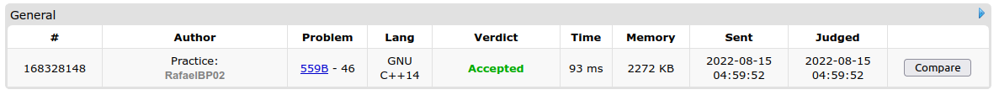
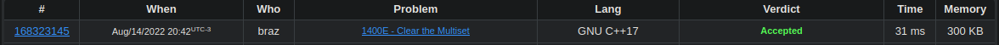
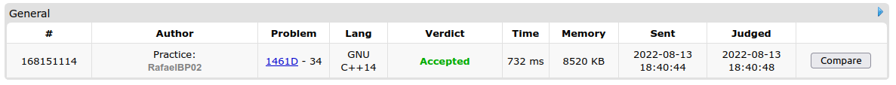
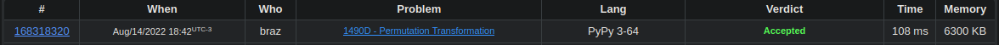

# D-C_CompetitionProblems 

**Conteúdo da Disciplina**: Dividir e Conquistar<br>

## Alunos
|Matrícula | Aluno | Usuario Codeforces
| -- | -- | -- |
| 18/0018159  |  Guilherme Veríssimo Cerveira Braz | braz
| 18/0108344  |  Rafael Berto Pereira | RafaelBP02

## Sobre 
Iremos resolver algumas questões do Codeforces, um site de questões de programação para competição. O trabalho será dividido em pastas onde cada uma contém a resolução da questão em C++, o binario, e um caso de teste in.txt

## Vídeo
Em Breve.
## Screenshots

### Qestão_559-B
Enunciado: https://codeforces.com/problemset/problem/559/B

Link do Accepted: https://codeforces.com/problemset/submission/559/168328148


### Questão_1400-E
Enunciado: https://codeforces.com/problemset/problem/1400/E

Link do Accepted: https://codeforces.com/problemset/submission/1400/168323145

### Qestão_1461-D
Enunciado: https://codeforces.com/contest/1461/problem/D

Link do Accepted: https://codeforces.com/problemset/submission/1461/168151114 


### Questão_1490-D
Enunciado: https://codeforces.com/contest/1490/problem/D

Link do Accepted: https://codeforces.com/problemset/submission/1490/168318320



## Instalação 
**Linguagem**: C++, Python3<br>
**Framework**: N/A<br>

## Uso 
abra o terminal dentro da pasta da respectiva questão e rode

```
g++ -o questao (nome da solução).C 
```
```
./questao < in.txt
```
## Outros 
N/A


